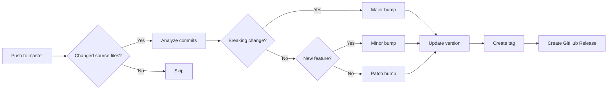

# Version Management Guide

Credit Castor uses automated version management with GitHub Actions.

## Quick Start

### 🚀 Automatic Versioning (Recommended)

Just commit and push - versioning happens automatically!

```bash
git add .
git commit -m "feat: add new feature"
git push origin master
```

The system automatically:
- ✅ Detects the type of change (feature/fix/breaking)
- ✅ Bumps the version accordingly
- ✅ Creates a git tag
- ✅ Generates a GitHub Release with changelog

### 🎯 Manual Versioning (When Needed)

For explicit control over versioning:

1. Go to **Actions** tab in GitHub
2. Select **"Version Bump"** workflow
3. Click **"Run workflow"**
4. Choose your bump type:
   - `patch` - Bug fixes (1.0.0 → 1.0.1)
   - `minor` - New features (1.0.0 → 1.1.0)
   - `major` - Breaking changes (1.0.0 → 2.0.0)
   - `auto` - Let the system decide

## Commit Message Format

Use [Conventional Commits](https://www.conventionalcommits.org/):

```
<type>(<scope>): <description>

[optional body]

[optional footer]
```

### Types

- **feat:** New feature → minor bump (1.0.0 → 1.1.0)
- **fix:** Bug fix → patch bump (1.0.0 → 1.0.1)
- **docs:** Documentation → patch bump
- **chore:** Maintenance → patch bump
- **test:** Tests → patch bump
- **refactor:** Code refactoring → patch bump
- **perf:** Performance improvement → patch bump
- **Breaking change:** → major bump (1.0.0 → 2.0.0)

### Examples

#### Feature (minor bump)
```bash
git commit -m "feat: add portage lot tracking"
git commit -m "feat(calculator): add new formula for notary fees"
```

#### Bug Fix (patch bump)
```bash
git commit -m "fix: resolve calculation rounding error"
git commit -m "fix(export): correct JSON format for dates"
```

#### Breaking Change (major bump)
```bash
git commit -m "feat!: redesign data structure

BREAKING CHANGE: The participant model has been completely
redesigned. Old JSON files will not be compatible."
```

## How It Works

### Automatic Workflow



### What Gets Updated

When a version bump happens:

1. **`src/utils/version.ts`**
   ```typescript
   export const RELEASE_VERSION = '1.1.0'; // Updated!
   ```

2. **`package.json`**
   ```json
   {
     "version": "1.1.0" // Updated!
   }
   ```

3. **Git tag created:** `v1.1.0`

4. **GitHub Release** with auto-generated changelog

## Version Compatibility

### JSON Export Versioning

Every JSON export includes the release version:

```json
{
  "version": 2,
  "releaseVersion": "1.0.0",
  "timestamp": "2025-11-03...",
  "participants": [...],
  ...
}
```

### Import Validation

When loading a JSON file:

- ✅ **Same version** → Loads successfully
- ❌ **Different version** → Shows alert:
  ```
  Version incompatible: ce fichier a été créé avec la version X.Y.Z,
  mais vous utilisez la version 1.0.0.

  Envoie le fichier à Dragan.
  ```

This ensures data compatibility and prevents loading incompatible files.

## Semantic Versioning

We follow [SemVer](https://semver.org/): **MAJOR.MINOR.PATCH**

- **MAJOR** (1.0.0 → 2.0.0)
  - Breaking changes
  - Incompatible data structures
  - Removed features

- **MINOR** (1.0.0 → 1.1.0)
  - New features
  - Backward compatible
  - Enhancements

- **PATCH** (1.0.0 → 1.0.1)
  - Bug fixes
  - Small improvements
  - Backward compatible

## Best Practices

### ✅ Do

- Write meaningful commit messages
- Use conventional commit format
- Let auto-bump handle versioning
- Test before pushing to master

### ❌ Don't

- Manually edit version numbers
- Skip commit message conventions
- Push directly without commits
- Use vague commit messages like "fix stuff"

## Troubleshooting

### Version not bumping?

**Check:**
1. Are you on `master` branch?
2. Did you change source files (`.ts`, `.tsx`, `.astro`)?
3. Does your commit message follow conventions?
4. Check workflow logs in Actions tab

### Wrong version bump?

**Solution:**
- Use manual **Version Bump** workflow
- Select the correct bump type
- This overrides the automatic detection

### Need to revert a version?

**Steps:**
1. Delete the tag: `git tag -d v1.x.x && git push origin :refs/tags/v1.x.x`
2. Delete the GitHub Release
3. Manual bump to correct version

## Monitoring

### View Releases

GitHub → Releases → See all versions with changelogs

### View Workflow Runs

GitHub → Actions → See version bump history

### Check Current Version

```bash
# In code
grep "RELEASE_VERSION" src/utils/version.ts

# In package.json
grep "version" package.json
```

## Advanced Usage

### Creating Pre-releases

For beta versions, manually tag:

```bash
git tag v1.1.0-beta.1
git push origin v1.1.0-beta.1
```

### Hotfix Workflow

1. Create hotfix branch from tag
2. Fix the bug
3. Merge to master
4. Use manual version bump → `patch`

### Release Notes

Auto-generated from commits, but you can edit:

1. Go to GitHub Releases
2. Click Edit on the release
3. Enhance the generated changelog

## More Info

See `.github/workflows/README.md` for detailed workflow documentation.

---

**Current Version:** Check [src/utils/version.ts](src/utils/version.ts)

**Latest Release:** See [GitHub Releases](https://github.com/dragan/credit-castor/releases)
