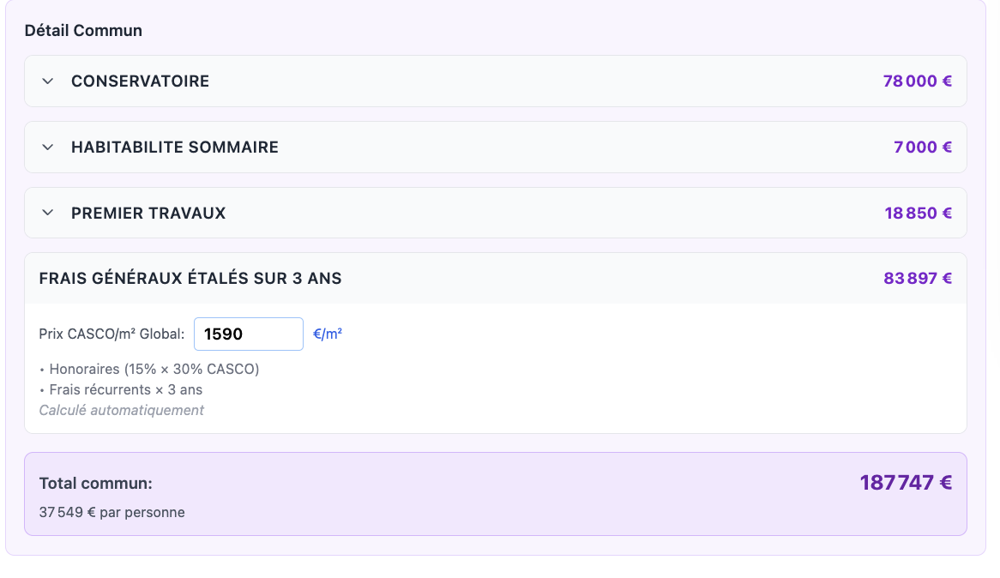

# Business Logic Assertions - Credit Castor

**Purpose**: Validate understanding of business logic through yes/no/partially questions.
**Created**: 2025-11-03
**Status**: Awaiting answers

---

## 1. Purchase & Division Calculations

**Assertion 1.1**: The purchase price is divided among participants based on their proportional surface area (surface × price per m²).
- **Answer**: yes

**Assertion 1.2**: When a scenario has a `purchasePriceReduction`, this reduces the total purchase price before calculating price per m², but doesn't affect individual participant surfaces.
- **Answer**:you can remove that, we won't use it. 

**Assertion 1.3**: Each participant can have a different notary fees rate applied to their purchase share.
- **Answer**: yes, 3 and 12,5%. They are not notary fees, they are registration fees, basically taxes paid when buying real estate. On top of that, there are also the usual notary fees.

**Assertion 1.4**: The `surface` field on a Participant represents their TOTAL surface area (already multiplied by quantity), not per-unit surface.
- **Answer**:this is not exactly "business logic", but yes, surface is total surface.

---

## 2. Construction Costs

**Assertion 2.1**: CASCO costs are always calculated using the global `globalCascoPerM2` rate - participants cannot override this with custom rates.
- **Answer**: yes

**Assertion 2.2**: Parachèvements costs can be customized per participant using `parachevementsPerM2`, otherwise they fall back to unit-specific rates from `unitDetails`.
- **Answer**: yes

**Assertion 2.3**: A participant can do partial renovation by specifying `cascoSqm` and `parachevementsSqm` that are less than their total surface.
- **Answer**: yes

**Assertion 2.4**: Travaux communs (common building works) are divided equally per participant unit quantity, not by surface area.
- **Answer**: yes, and recurring costs as well. (appel de fonds, fonds de réserve, etc.). We might change that to make it hybrid (part surface (quotité), part quantity) in the future.

**Assertion 2.5**: The scenario's `constructionCostChange` percentage applies to both CASCO and parachèvements, but NOT to travaux communs.
- **Answer**: I don't know what you mean by "constructionCostChange".

---

## 3. Frais Généraux (General Expenses)

**Assertion 3.1**: Frais généraux for 3 years is calculated dynamically as: (Total CASCO × 15% × 30%) + recurring costs × 3 years + one-time costs.
- **Answer**: I need to double-check that.

**Assertion 3.2**: The "Total CASCO" used for frais généraux includes both personal unit CASCO and common building CASCO (travaux communs).
- **Answer**: yes, the total casco is specifically to calculate the part of frais généraux paid to architects as a percentage of total casco.

**Assertion 3.3**: The 15% × 30% formula represents professional fees (architects, stability experts, PEB, etc.).
- **Answer**: architects only.

**Assertion 3.4**: Recurring yearly costs include: property tax (388.38€), accountant (1000€), Podio (600€), building insurance (2000€), reservation fees (2000€), and contingencies (2000€).
- **Answer**: yes, but also the syndic fees (gestion de la copropriété) if applicable, and charges communes (water, electricity, cleaning, maintenance, etc.) if applicable.

---

## 4. Shared Costs Distribution

**Assertion 4.1**: Shared infrastructure costs are divided equally among all participants (per person, not per unit or per surface).
- **Answer**: this disappeared, it's now all in "commun".

**Assertion 4.2**: If `expenseCategories` is defined, it completely replaces the legacy infrastructure fields (mesuresConservatoires, demolition, infrastructures, etc.).
- **Answer**:  this is all the non recurring costs there are:

**Assertion 4.3**: The scenario's `infrastructureReduction` only applies to the `infrastructures` field, not to other shared costs.
- **Answer**: this disappeared, it's now all in "commun", and there is no reduction to tweak it.

---

## 5. Loan & Financing Calculations

**Assertion 5.1**: Loan amount needed = Total cost (purchase + notary + construction + shared) - capital contributed.
- **Answer**: yes

**Assertion 5.2**: Each participant can have different loan terms (interest rate, duration) for their financing.
- **Answer**: yes 

**Assertion 5.3**: Monthly payment is calculated using the standard mortgage PMT formula with monthly compounding.
- **Answer**: yes (to be verified later)

**Assertion 5.4**: Financing ratio = (loan amount / total cost) × 100, representing the percentage financed by loan.
- **Answer**: yes

---

## 6. Portage Calculations (Resale Pricing)

**Assertion 6.1**: When a founder sells a lot to a newcomer, the resale price includes: base acquisition cost + indexation + carrying cost recovery + renovations.
- **Answer**: it should also include recovery of notary fees, registration fees, frais communs, recurring costs, loan interest, etc. Basically everything the founder paid when buying and owning the lot. The same mechanism applies partially when a newcomer buys from the copropriété (hidden lots), but in that case there is no "founder", so the base acquisition cost is calculated differently, because there were less taxes as it wasn't real estate until "revealed" as real estate at resale.

**Assertion 6.2**: The "base acquisition cost" for portage includes: original purchase share + original notary fees + original construction costs.
- **Answer**: I need to double-check that, tell me how it's calculated in the code.

**Assertion 6.3**: Indexation is calculated using compound interest at the formula's `indexationRate` (default 2%) for the years held.
- **Answer**: it's directly linked to the legal index published by the Belgian government, not a fixed 2%. We can provide you with the index values for each year if needed.

**Assertion 6.4**: Carrying costs include: monthly loan interest + Belgian empty property tax (388.38€/year) + insurance (2000€/year).
- **Answer**: these are all the recurring costs associated with holding the property. + other mentioned above, linked to the fact that the founder is part of a copropriété (syndic fees, charges communes, etc.) and has to pay their share of that second "lot" as well, by law.

**Assertion 6.5**: The seller can recover a percentage of carrying costs (default 100%), configurable via `carryingCostRecovery`.
- **Answer**: yes

**Assertion 6.6**: Years held is calculated as the fractional time difference between founder's entry date (deed date) and buyer's entry date, normalized to start of day to avoid timezone issues.
- **Answer**: yes, practuically it's the time between when the founder bought and when the founder sells to the newcomer.

---

## 7. Copropriété Lots

**Assertion 7.1**: When the copropriété sells a hidden lot, the sale proceeds are redistributed to all current participants (founders + newcomers) based on their quotité.
- **Answer**: Not exactly, the proceeds go to all current coowners at the moment of the sale coowners, based on their quotité. Except the buyer of the hidden lot, who pays the copropriété and thus increases the copropriété's total value, which benefits all coowners including themselves. The coowners (founders + newcomers) can decide to use the proceeds to reduce their outstanding loan, or withdraw it as cash, or leave it in the copropriété account for future expenses.

**Assertion 7.2**: A participant's quotité = (their surface) / (total building surface), representing their ownership share in the copropriété.
- **Answer**: Yes, but it's more complex than that. The quotité is defined in the deed of the copropriété, and is not always strictly proportional to surface. It can be influenced by other factors defined in the deed, such as lot type, location, etc.

**Assertion 7.3**: For copropriété lots, the buyer can choose any surface up to the available copro lot surface (surface is "free" not "imposed").
- **Answer**: Yes, the buyer has the flexibility to choose their desired surface area within the limits of the available copropriété lot surface, and depending on when they buy (earlier buyers have more options), as the renovation progresses and there's less flexibility on surface modulation and layout.

**Assertion 7.4**: Copropriété lot pricing is proportional: (chosen surface / total copro lot surface) × total lot price.
- **Answer**: yes, + any adjustments based on the carrying costs, renovations, etc. as explained above.

**Assertion 7.5**: The MVP uses estimated pricing for copro lots (1377€/m² base + 5% annual carrying cost) when detailed financials aren't available.
- **Answer**: no. the price by sqm is constantly changing depending on how many copro and portage lots are already sold, how much renovation is done, etc. The 1377€/m² was just an initial estimate at the very start of the project, but we quickly moved to a dynamic pricing model based on actual costs incurred above all base on how many participants are already in the copropriété, how much renovation is done, etc. 

---

## 8. Timeline & Event Sourcing

**Assertion 8.1**: The system uses event sourcing where events are immutable facts (INITIAL_PURCHASE, NEWCOMER_JOINS, etc.) and projections are computed views derived from events.
- **Answer**: NO, this was dropped totally. Forget about it and clean up everything related to event sourcing in the code and the tests. We might use a state machine later, but not event sourcing.

**Assertion 8.2**: Founders are participants who entered at the deed date (`isFounder: true`, `entryDate` = deed date).
- **Answer**:yes, means they were part of the initial purchase, and most of them, if not all invested a lot of time and effort in the project from the start.

**Assertion 8.3**: Each lot tracks its acquisition date, which is used to calculate years held for portage pricing.
- **Answer**: As there will be the concept of portage (carried by copropriété for sure and maybe some individuals as well) only for the first generation of buyers (founders), only founders' lots will have acquisition dates. Newcomers' lots won't have acquisition dates, as they won't be able to do portage resale in this version of the calculator. The idea is to repay the few founders who took the risk to start the project in the first place, not to create a full resale market for newcomers.

**Assertion 8.4**: A participant can own multiple lots via the `lotsOwned` array, replacing the legacy `unitId + surface + quantity` pattern.
- **Answer**: Yes, the `lotsOwned` array allows for a more flexible and scalable representation of lot ownership, accommodating multiple lots per participant without the need for redundant fields. And is a a better representation of reality.

**Assertion 8.5**: When a participant purchases from another participant, the purchase details track: who they bought from, the lot ID, purchase price, and breakdown (base price, indexation, carrying cost recovery, fees recovery, renovations).
- **Answer**: yes, but only for founders or copropriété selling to newcomers (Generation 2). This is portage. There is no resale tracking between ulterior participants (>= Generation 2 selling to Gen 3, et cetera) in this version of the calculator. And there won't be, as we want to keep it simple and focused on the initial portage mechanism to help founders recover their investment and encourage newcomers to join the copropriété at a fair price.

---

## 9. Legacy vs New Data Model

**Assertion 9.1**: The system maintains backward compatibility by keeping legacy fields (`unitId`, `surface`, `quantity`) alongside the new `lotsOwned` array.
- **Answer**: Let's not do that, we can remove all legacy fields from the code and tests. Only `lotsOwned` should be used going forward.

**Assertion 9.2**: In the current implementation, if `lotsOwned` is present, the calculator should use it instead of the legacy fields, but the calculator still requires legacy fields for now.
- **Answer**: No, the calculator should only use `lotsOwned`. Remove all legacy fields and related code.

---

## 10. Belgian Real Estate Regulations

**Assertion 10.1**: The 388.38€ annual tax is the Belgian empty property tax ("précompte immobilier") that applies to unoccupied properties.
- **Answer**: This is the annual property tax (précompte immobilier) based on the current value of this property, not specifically for empty properties. It applies to all property owners in Belgium, regardless of occupancy status.

**Assertion 10.2**: Notary fees in Belgium vary by participant (typical rates might be 12.5% for some, different for others based on their situation).
- **Answer**: No. Notary fees are what's paid to the notary are under the law of freemarket. They're not yet mentioned in this version of the calculator, but will be added later. What we have now are the registration fees (taxes) that are paid to the government when buying real estate, which are different rates depending on the region (Wallonia, Flanders, Brussels) and sometimes participant situation (first-time buyer, etc.)

**Assertion 10.3**: This calculator is specifically for Wallonia region real estate regulations, not Flanders or Brussels.
- **Answer**: Yes, as 3% and 12.5% are Wallonia region registration fees rates.

---

## Additional Questions / Clarifications

### Question A: Unit Quantity Semantics
When a participant has `quantity: 2`, does this mean:
- (a) They own 2 separate apartments of the same type/size
- (b) Something else (please explain)

**Answer**: I think this is legacy and should be removed. Participants own multiple lots via the `lotsOwned` array now, so `quantity` is no longer relevant. Each entry in `lotsOwned` can represent a separate apartment or unit with its own details.

### Question B: Travaux Communs Distribution
You mentioned travaux communs is divided "per participant unit quantity". If Alice has quantity=2 and Bob has quantity=1, does Alice pay 2× the travaux communs?

**Answer**: Yes more or less. But as said above, we might change that to make it hybrid (part surface (quotité), part quantity) in the future.

### Question C: Surface Imposed vs Free
For portage lots from founders (surface imposed), can you explain what "imposed" means in practice? Is the newcomer required to buy the exact surface the founder held?

**Answer**: Yes because the founder already defined the surface when they joined the copropriété, in the acte de base. It can be modified but induces costs and potentially renovation. The newcomer has to accept that surface as is, they can't change it. Only for copropriété lots (hidden lots) can the buyer have a little more flexibility on surface area within the limits of the available copropriété lot surface, and depending on when they buy (earlier buyers have more options), as the renovation progresses and there's less flexibility on surface modulation and layout.

### Question D: Copropriété Hidden Lots Origin
Where do hidden lots come from initially? Are they:
- (a) Part of the initial purchase that no founder claimed
- (b) Something else (please explain)

**Answer**: The property has around 500sqm of surface affectée au logement. and 2000 more sqm for which a permit must be obtained to convert it to housing (the former industrial part). The hidden lots are created by dividing this unclaimed surface into smaller lots that can be sold to newcomers later. The exact number and size of hidden lots can vary based on how the renovation and division is planned. A granted permit can be enacted later, within 3 years of the initial purchase. This means that the hidden lots have to be declared in the acte de base max 3 years after permit is granted. Otherwise a new permit has to be requested.

### Question E: Frais Généraux Scope
The frais généraux covers 3 years. Does this represent:
- (a) The expected construction period
- (b) An initial operational period after purchase
- (c) Something else (please explain)

**Answer**: It's typical from how architects and other professionals charge their fees in Belgium for construction projects. They usually charge a percentage of the total construction cost as their fees, spread over the duration of the project, which is often estimated at around 3 years for a project of this scale. So it's more about covering the professional fees and associated costs during the construction period.

### Question F: Insurance Split
The 2000€ annual insurance in carrying costs - is this:
- (a) The full building insurance divided among all portage lots
- (b) Per-lot insurance cost
- (c) Something else (please explain)

**Answer**: a) 2000€ is the total annual building insurance cost for the entire property. This cost is then divided among all participants based on their ownership share (quotité) in the copropriété.

---

## Notes Section

(Add any additional context, corrections, or clarifications here)

