# Cas d'Usage et Flux de Décision

> **Version actuelle** : 1.37.0
> **Dernière mise à jour** : 2025-11-15
> **Statut** : ✅ Complet et à jour

> Guide pratique des scénarios réels et arbres de décision pour Credit Castor
>
> **Objectif**: Comprendre comment les règles métiers s'appliquent dans des situations concrètes

> **📚 Navigation Documentation**
> - **Guide textuel complet** : [`guide-complet-mecanismes-regles.md`](./guide-complet-mecanismes-regles.md)
> - **Diagrammes visuels** : [`regles-metiers-diagrammes-pedagogiques.md`](./regles-metiers-diagrammes-pedagogiques.md)
> - **Guide de navigation** : [`README-REGLES-METIERS.md`](./README-REGLES-METIERS.md)

## Table des Matières

1. [Parcours Fondateur](#1-parcours-fondateur)
2. [Parcours Nouveau Venu](#2-parcours-nouveau-venu)
3. [Arbres de Décision](#3-arbres-de-décision)
4. [Scénarios Complets](#4-scénarios-complets)
5. [Règles de Validation](#5-règles-de-validation)

---

## 1. Parcours Fondateur

### Lifecycle Complet

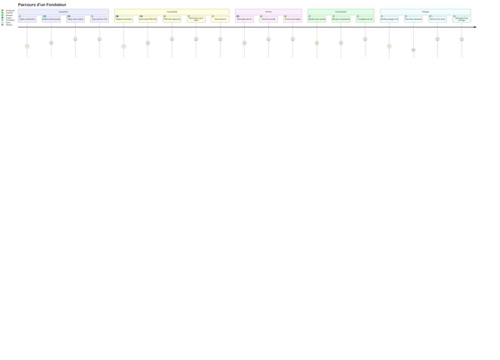

### Décisions Clés du Fondateur

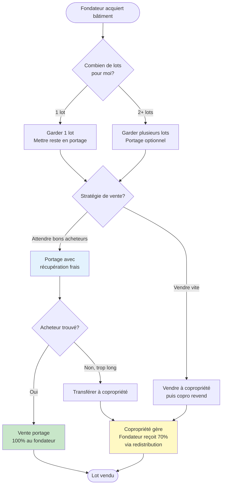

### Calcul Coûts Fondateur

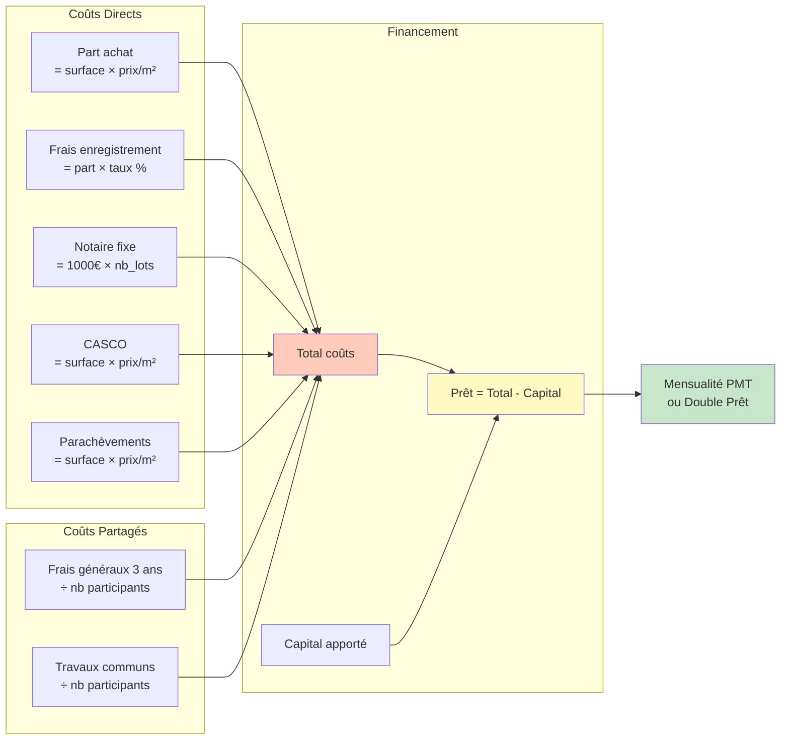

---

## 2. Parcours Nouveau Venu

### Journey Map

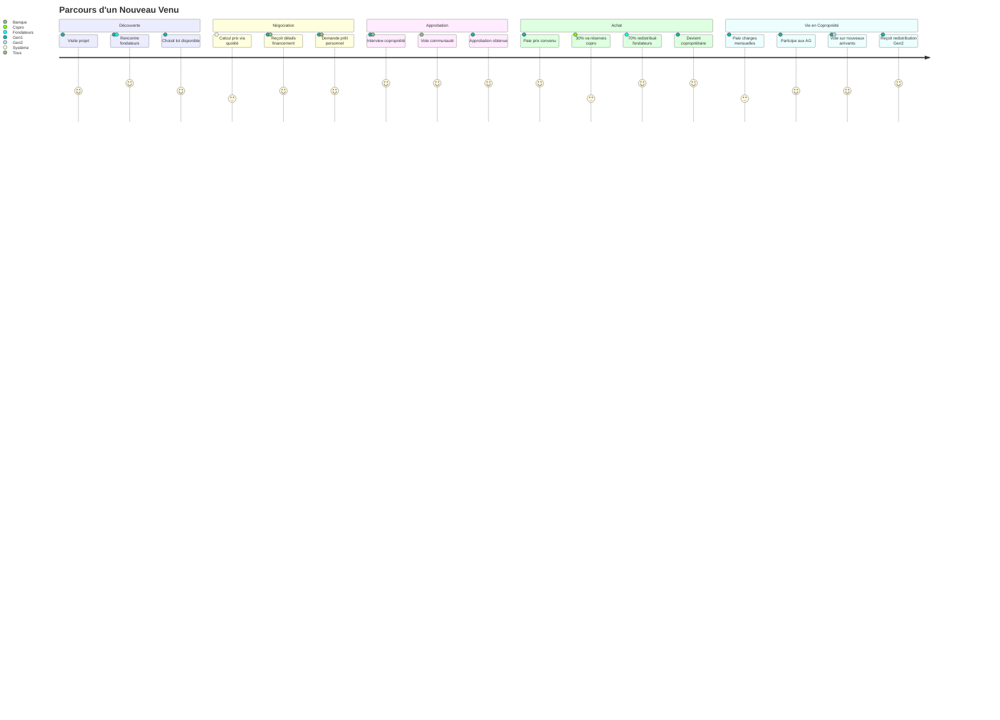

### Arbre de Décision Achat

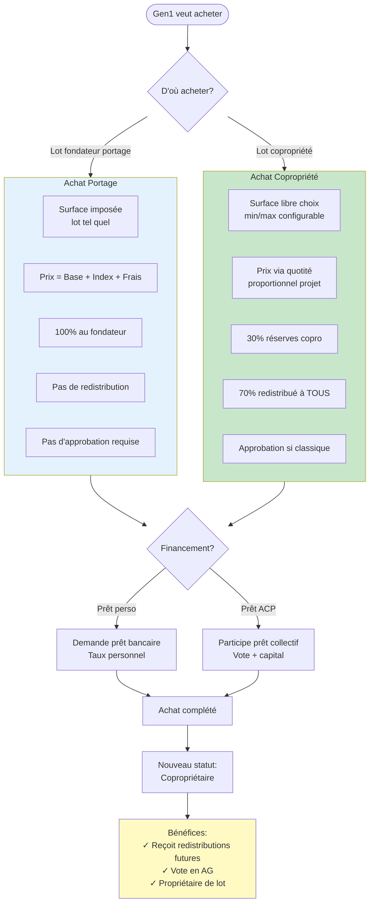

### Calcul Prix Nouveau Venu (Copropriété)

```mermaid
flowchart TB
    Start([Gen1 choisit 60 m²])

    Start --> Context[Contexte:<br/>Surface totale: 300 m²<br/>Coût projet: 600,000€<br/>Années depuis T0: 3 ans]

    Context --> Step1[1. Quotité =<br/>60 / (300 + 60) = 16.67%]

    Step1 --> Step2[2. Prix base =<br/>600,000 × 16.67% = 100,000€]

    Step2 --> Step3[3. Indexation 2%/an composé =<br/>100,000 × 1.02³ - 1 = 6,121€]

    Step3 --> Step4[4. Frais portage =<br/>Copro frais × quotité × 100%<br/>= 30,000 × 16.67% = 5,000€]

    Step4 --> Total[Total Prix:<br/>100,000 + 6,121 + 5,000<br/>= 111,121€]

    Total --> Split{Répartition}

    Split -->|30%| Reserves[Réserves Copro:<br/>33,336€]
    Split -->|70%| Redistrib[Redistribution:<br/>77,785€]

    Redistrib --> Founders[Fondateurs reçoivent<br/>selon leurs quotités<br/>proportionnellement]

    Founders --> Example[Exemple:<br/>Alice 200m² → 66.67% → 51,857€<br/>Bob 100m² → 33.33% → 25,928€]

    style Total fill:#fff9c4
    style Reserves fill:#c8e6c9
    style Redistrib fill:#ffccbc
    style Example fill:#e1f5ff
```

---

## 3. Arbres de Décision

### Choix Type de Financement

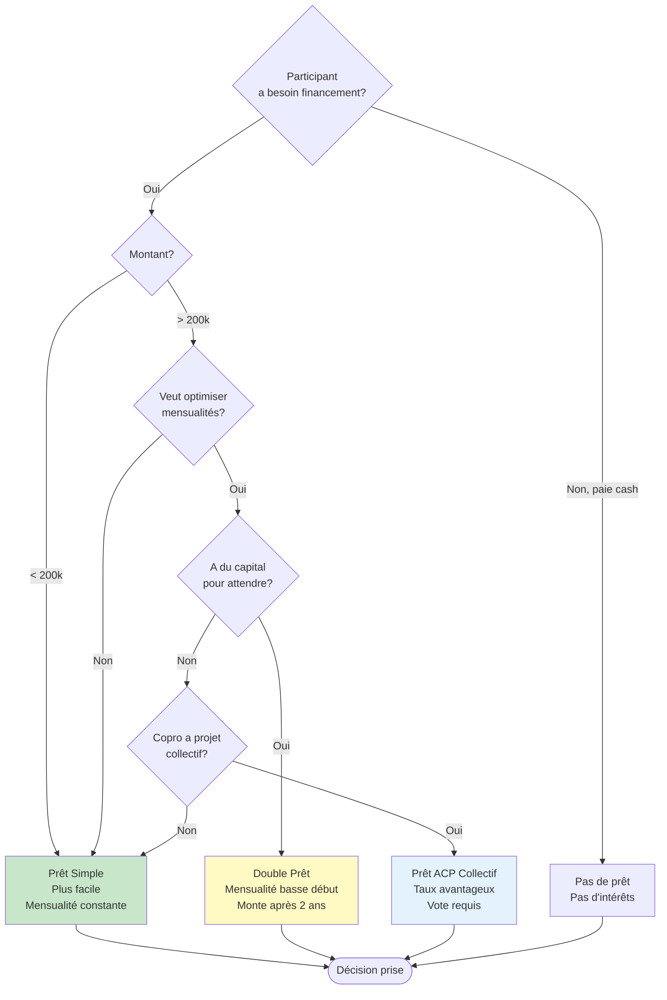

### Validation Prix Vente

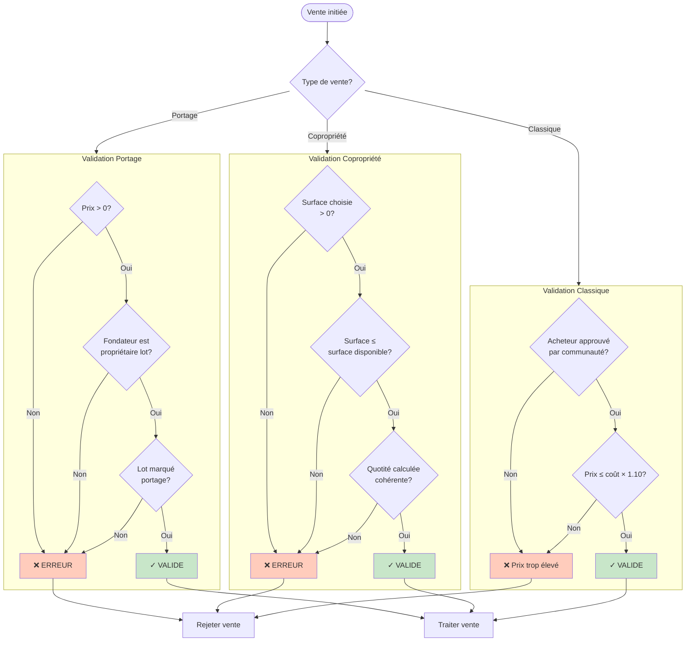

### Gestion Rent-to-Own

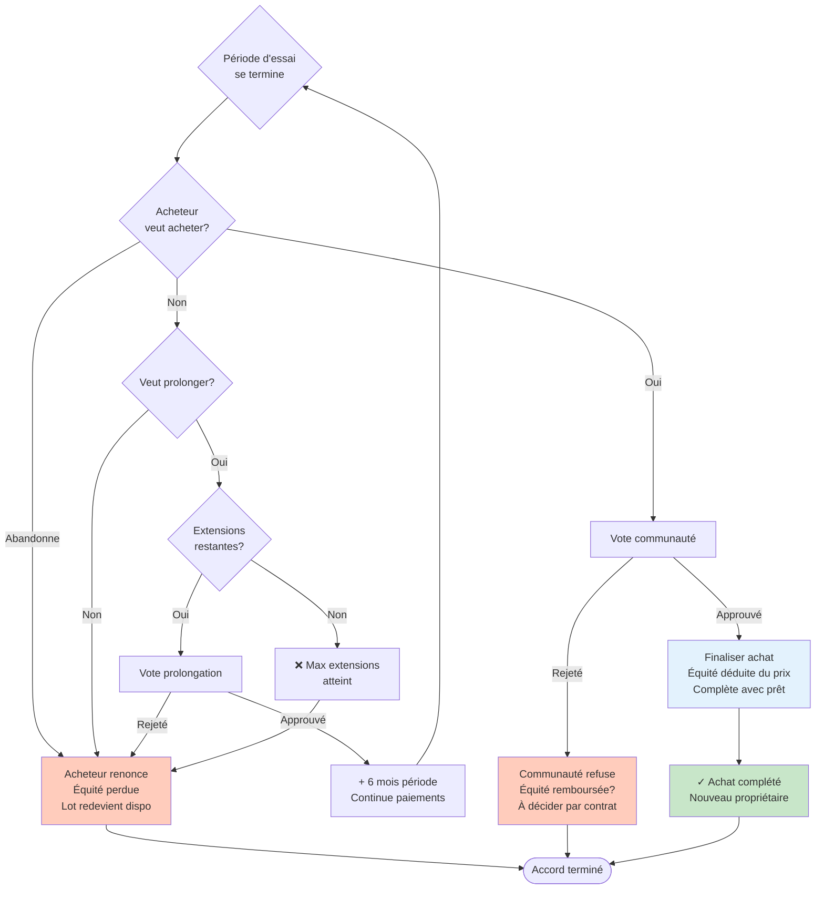

---

## 4. Scénarios Complets

### Scénario 1: Projet 4 Fondateurs → 2 Nouveaux Venus

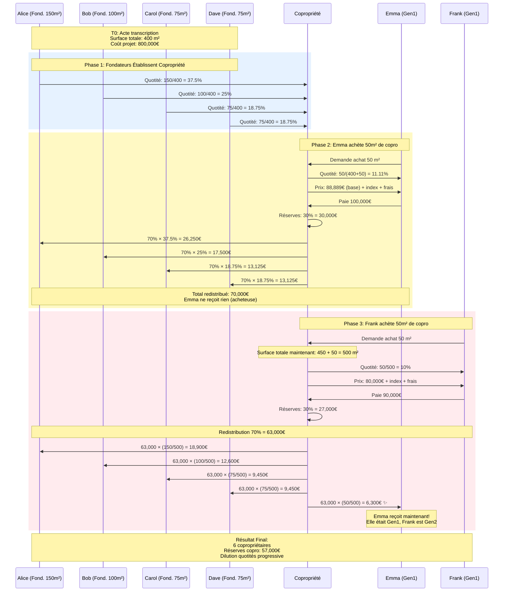

### Scénario 2: Fondateur Portage → Vente

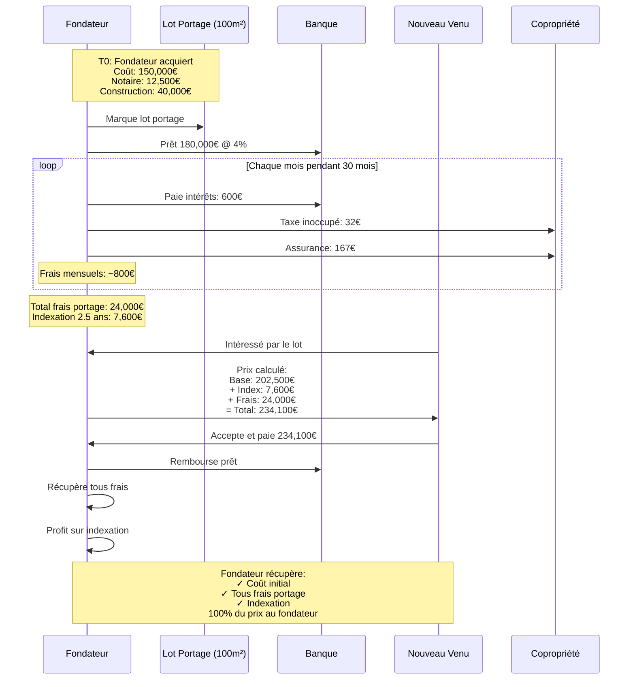

### Scénario 3: Prêt ACP Collectif

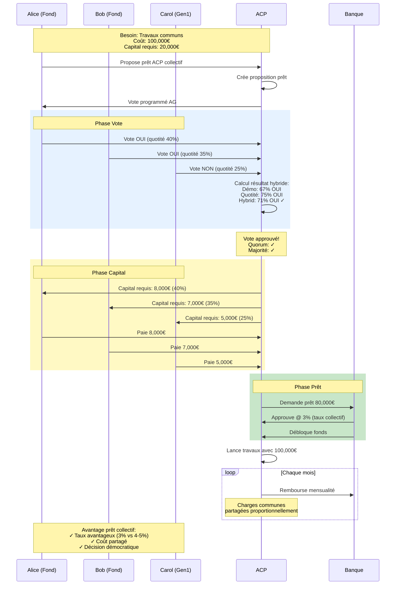

---

## 5. Règles de Validation

### Validation Participant

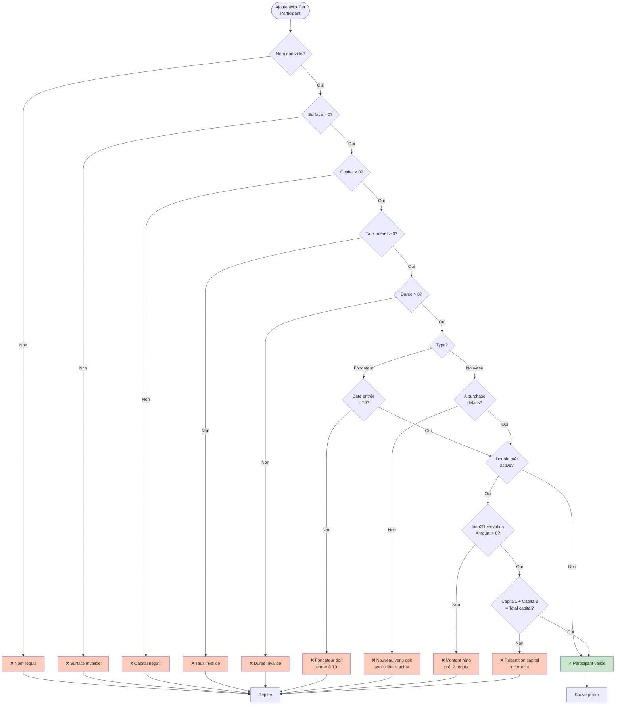

### Validation Projet

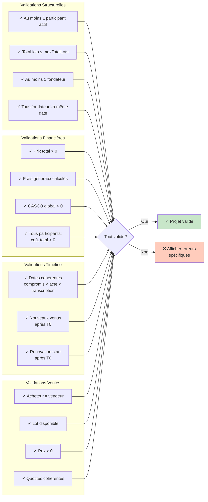

### Cohérence Quotités

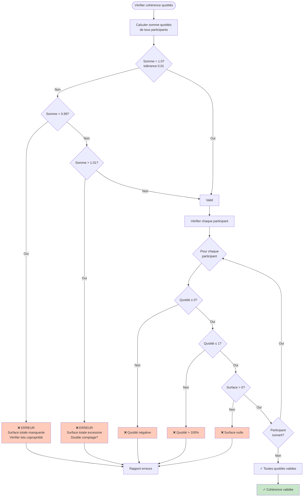

---

## Matrice de Compatibilité

### Actions par État du Projet

| Action | pre_purchase | compromis | deed_pending | ownership | copro_creation | copro_established | permit_active | sales_active |
|--------|--------------|-----------|--------------|-----------|----------------|-------------------|---------------|--------------|
| **Ajouter fondateur** | ✓ | ✓ | ✓ | ⚠️ | ⚠️ | ✗ | ✗ | ✗ |
| **Modifier fondateur** | ✓ | ✓ | ✓ | ✓ | ✓ | ✓ | ✓ | ✓ |
| **Ajouter nouveau venu** | ✗ | ✗ | ✗ | ✗ | ✗ | ✗ | ✗ | ✓ (via vente) |
| **Marquer lot portage** | ✗ | ✗ | ✗ | ✓ | ✓ | ✓ | ✓ | ✓ |
| **Vendre lot** | ✗ | ✗ | ✗ | ✗ | ✗ | ✗ | ✗ | ✓ |
| **Modifier params projet** | ✓ | ✓ | ✓ | ✓ | ✓ | ✓ | ✓ | ⚠️ |
| **Créer prêt ACP** | ✗ | ✗ | ✗ | ✗ | ✗ | ✓ | ✓ | ✓ |

**Légende:**
- ✓ : Autorisé
- ✗ : Interdit
- ⚠️ : Autorisé mais attention (peut impacter calculs existants)

---

## Formules de Référence Rapide

### 1. Quotité
```
quotité = surface_participant / surface_totale_à_date_vente
```
**Important**: Dénominateur inclut l'acheteur pour calculer son prix

### 2. Indexation Composée
```
indexation = montant_base × [(1 + taux/100)^années - 1]
```
**Défaut**: 2% par an

### 3. Prix Portage
```
prix_total = (achat + notaire + construction) + indexation + frais_portage + rénovations
```
**Récupération**: 100% au fondateur vendeur

### 4. Prix Copropriété
```
base = (coût_projet / surface_totale) × surface_achetée
total = base + indexation + (frais_portage × quotité)
```
**Répartition**: 30% réserves + 70% redistribution

### 5. Redistribution
```
montant_participant = (70% × prix_total) × quotité_participant
```
**Récursif**: Tous participants existants reçoivent (sauf acheteur)

### 6. Frais Généraux
```
honoraires_3ans = CASCO_hors_TVA × 15% × 30%
honoraires_annuels = honoraires_3ans / 3
total_annuel = honoraires_annuels + frais_récurrents (7,988.38€)
total_3ans = total_annuel × 3
par_participant = total_3ans / nb_participants
```

### 7. Double Prêt
```
prêt1 = achat + notaire + frais - capital1
prêt2 = loan2RenovationAmount - capital2
mensualité_période1 = PMT(prêt1)
mensualité_période2 = PMT(prêt1) + PMT(prêt2)
```

---

## Note sur les Espaces Partagés (v1.36.0+)

Ce document se concentre sur les parcours fondateurs et nouveaux venus pour l'acquisition et la gestion des lots.

Pour les **espaces partagés** (ateliers, salles communes, jardins, etc.) avec leurs trois modèles de gouvernance (solidaire, commercial, quota), consulter :
- **Diagrammes complets** : [`regles-metiers-diagrammes-pedagogiques.md` - Section 10](./regles-metiers-diagrammes-pedagogiques.md#10-gestion-des-espaces-partagés)
- **Guide textuel** : [`guide-complet-mecanismes-regles.md` - Section 11](./guide-complet-mecanismes-regles.md#gestion-des-espaces-partagés)

---

**Note**: Ces diagrammes sont des guides pédagogiques. Pour l'implémentation exacte, consulter le code source dans:
- **State Machines** : `src/stateMachine/creditCastorMachine.ts`, `rentToOwnMachine.ts`, `sharedSpaceMachine.ts`
- **Calculs** : `src/utils/portageCalculations.ts`, `calculatorUtils.ts`
- **Types & Événements** : `src/stateMachine/types.ts`, `events.ts`

**Dernière mise à jour**: 2025-11-15
**Version**: 1.37.0
