# Règles Métiers - Diagrammes Pédagogiques

> Documentation visuelle complète des règles métiers de Credit Castor
>
> **Objectif**: Fournir une compréhension claire et visuelle des mécanismes complexes du système pour tous les membres du projet.

## Table des Matières

1. [Vue d'Ensemble du Système](#1-vue-densemble-du-système)
2. [Cycle de Vie du Projet (State Machine)](#2-cycle-de-vie-du-projet-state-machine)
3. [Mécanisme de Redistribution Copropriété](#3-mécanisme-de-redistribution-copropriété)
4. [Calculs de Portage](#4-calculs-de-portage)
5. [Types de Ventes](#5-types-de-ventes)
6. [Financement (Simple vs Double Prêt)](#6-financement-simple-vs-double-prêt)
7. [Frais Généraux Dynamiques](#7-frais-généraux-dynamiques)
8. [Rent-to-Own](#8-rent-to-own)
9. [Structures de Données](#9-structures-de-données)

---

## 1. Vue d'Ensemble du Système

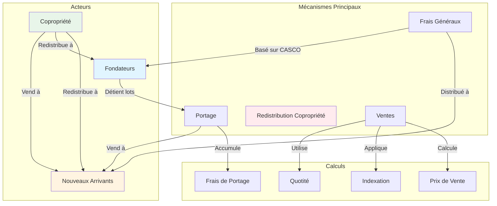

### Concepts Clés

- **Fondateurs**: Participants originaux qui acquièrent le bâtiment à T0 (date acte transcription)
- **Quotité**: Part de propriété = (Surface participant) / (Surface totale)
- **Portage**: Mécanisme permettant aux fondateurs de conserver des lots en attendant des acheteurs
- **Redistribution**: 70% des ventes copropriété redistribués proportionnellement à tous les participants existants

---

## 2. Cycle de Vie du Projet (State Machine)

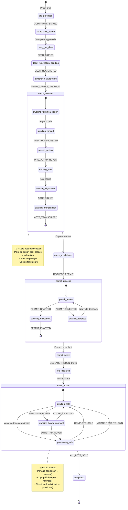

### Événements Globaux

Ces événements sont disponibles dans **TOUS** les états:

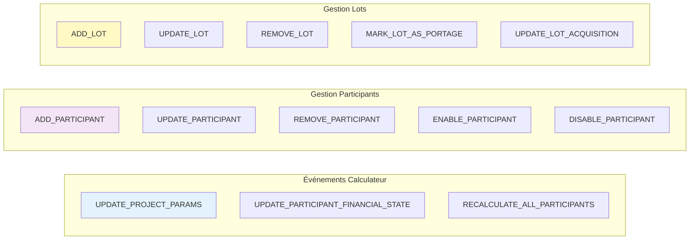

---

## 3. Mécanisme de Redistribution Copropriété

### Vue d'Ensemble

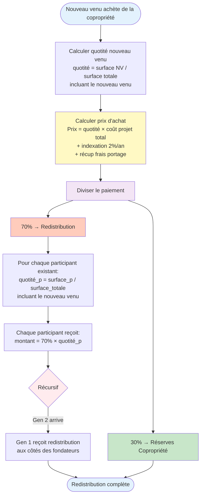

### Exemple Concret

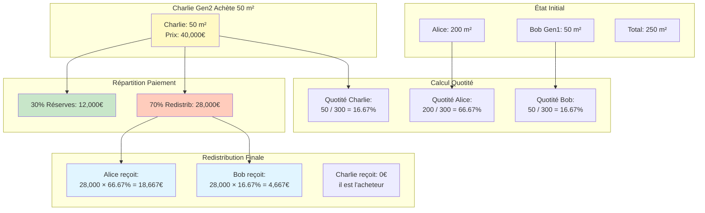

### Formules Clés

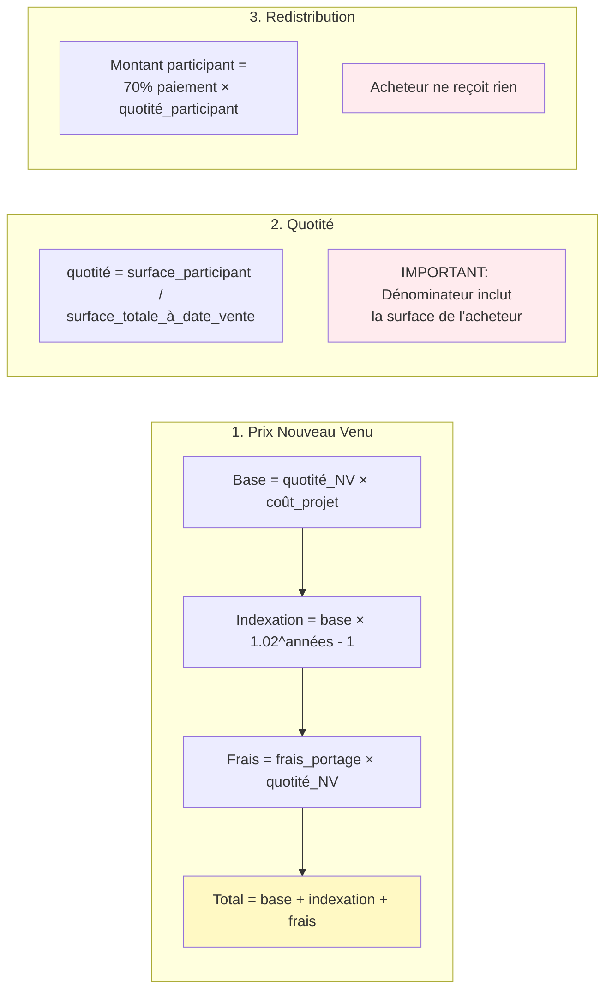

---

## 4. Calculs de Portage

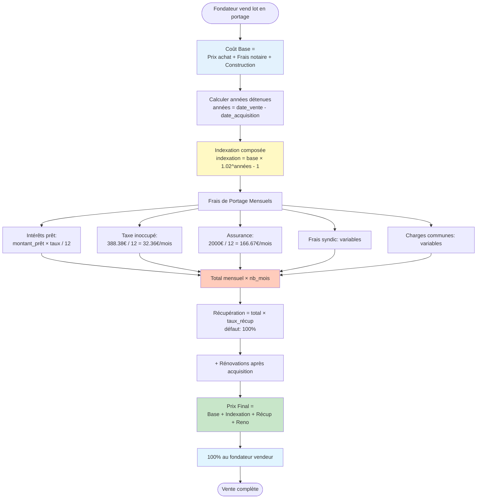

### Exemple de Calcul

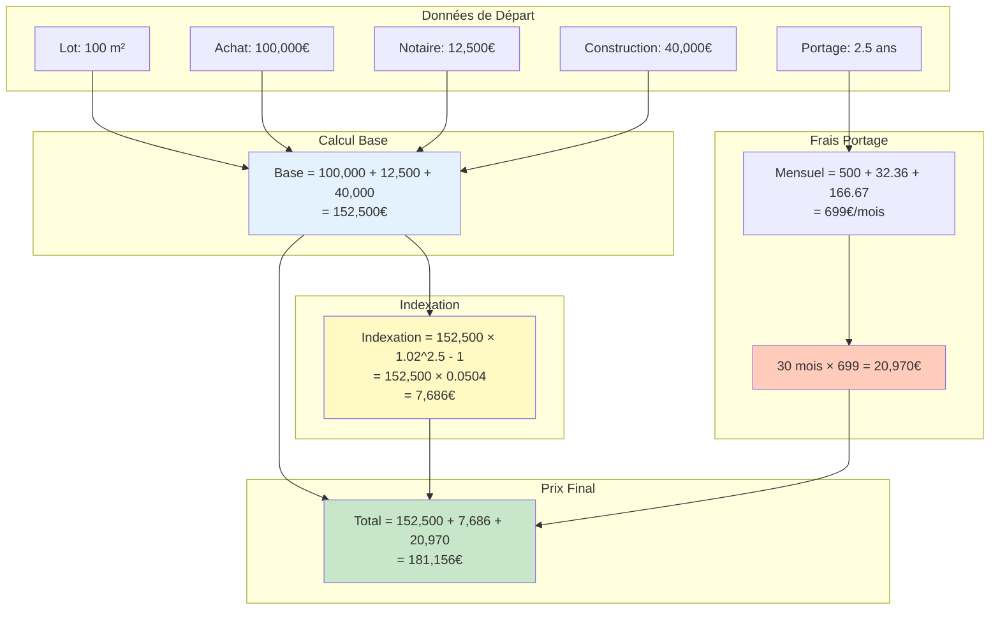

---

## 5. Types de Ventes

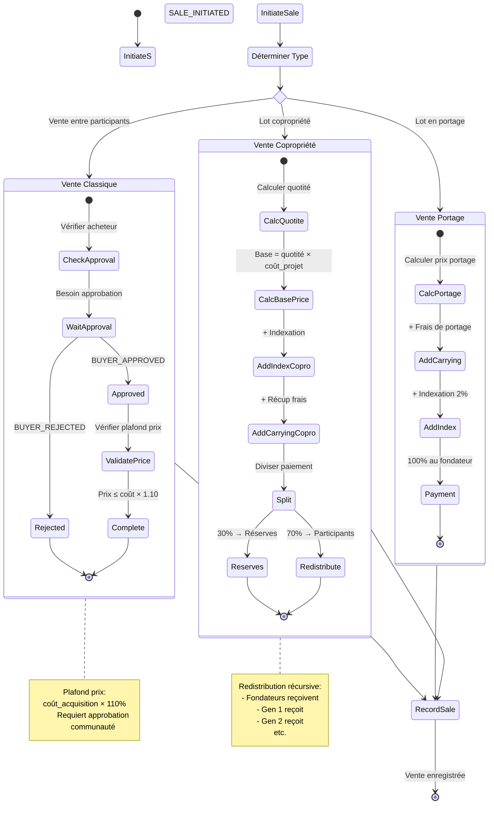

### Matrice de Décision

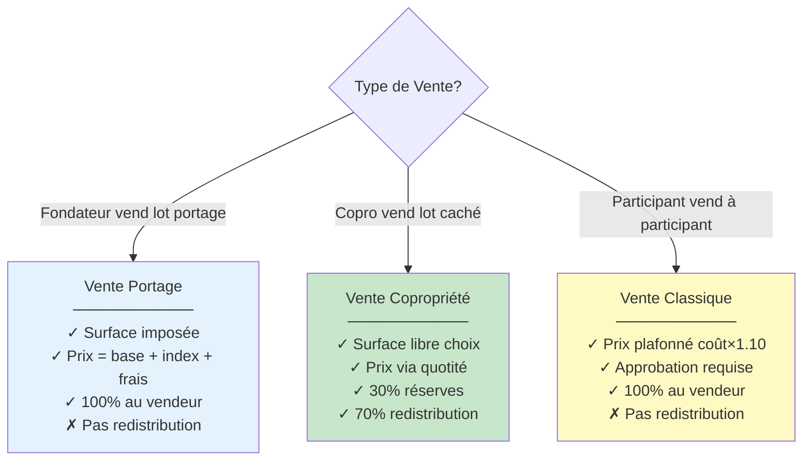

---

## 6. Financement (Simple vs Double Prêt)

### Financement Simple

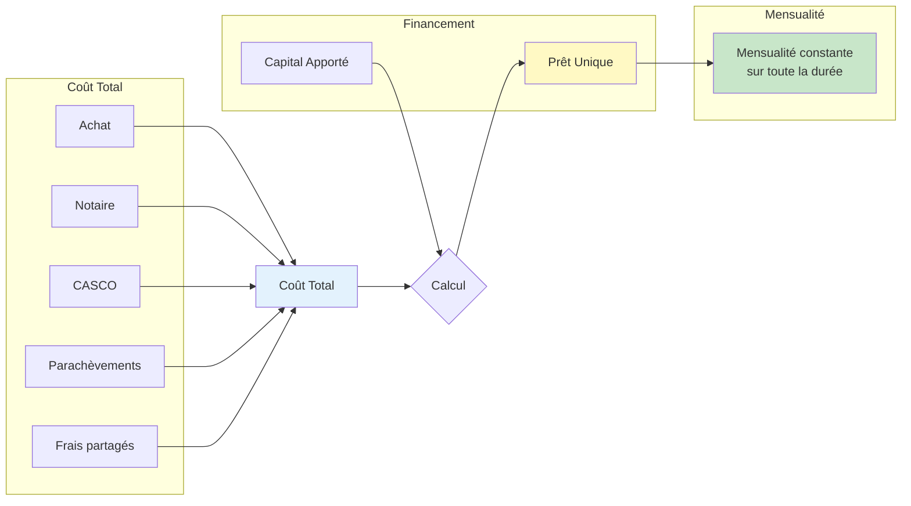

### Financement Double Prêt

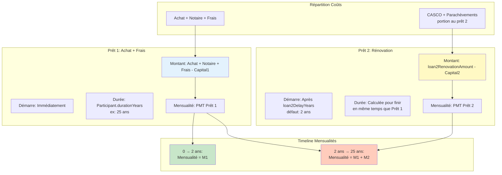

### Exemple Double Prêt

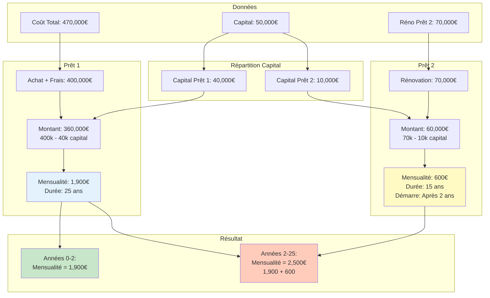

---

## 7. Frais Généraux Dynamiques

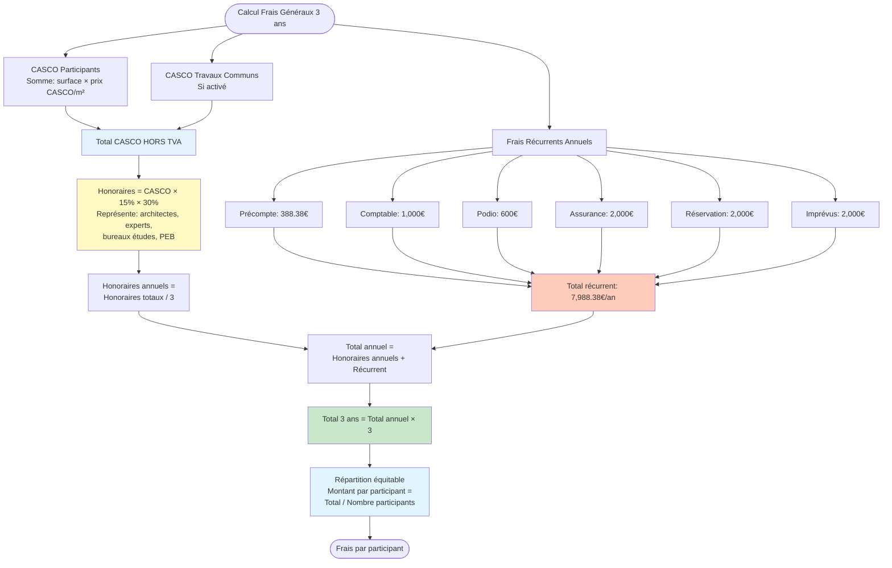

### Formule Détaillée

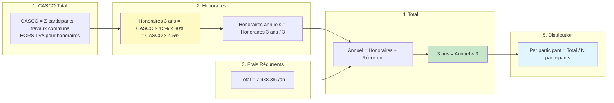

---

## 8. Rent-to-Own

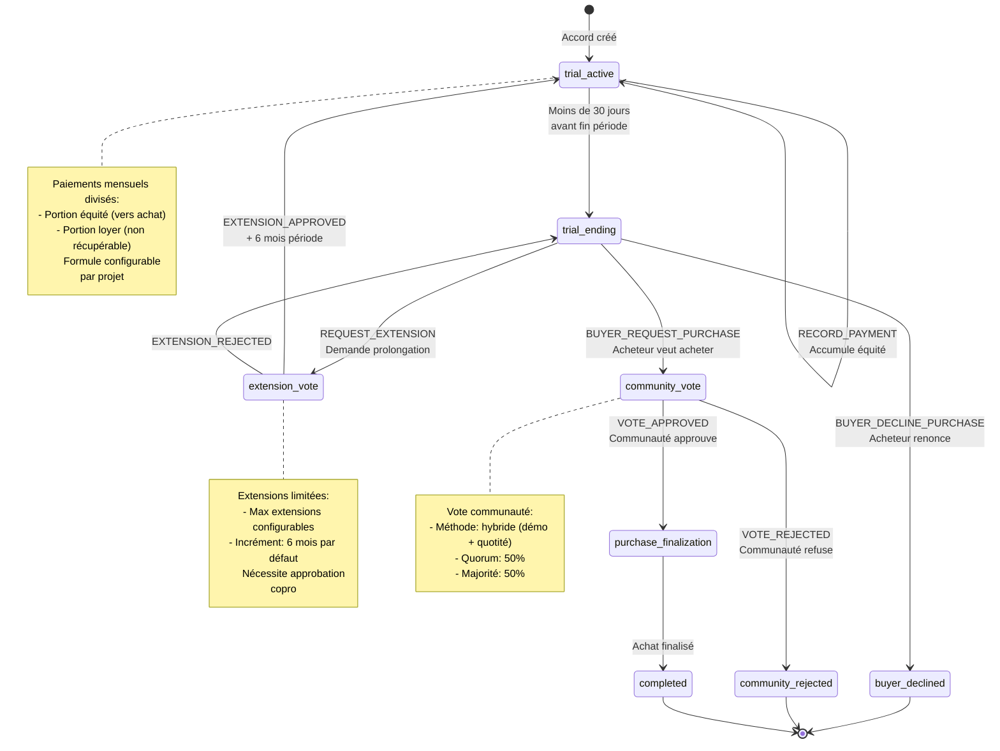

### Calcul Paiements

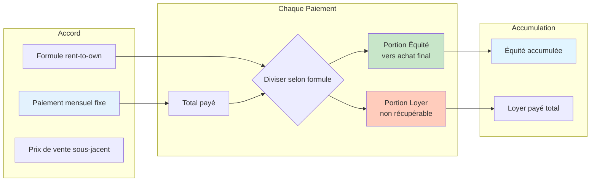

---

## 9. Structures de Données

### Participant

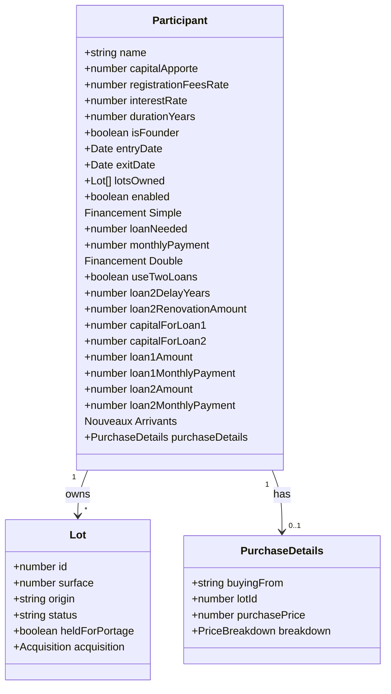

### ProjectParams

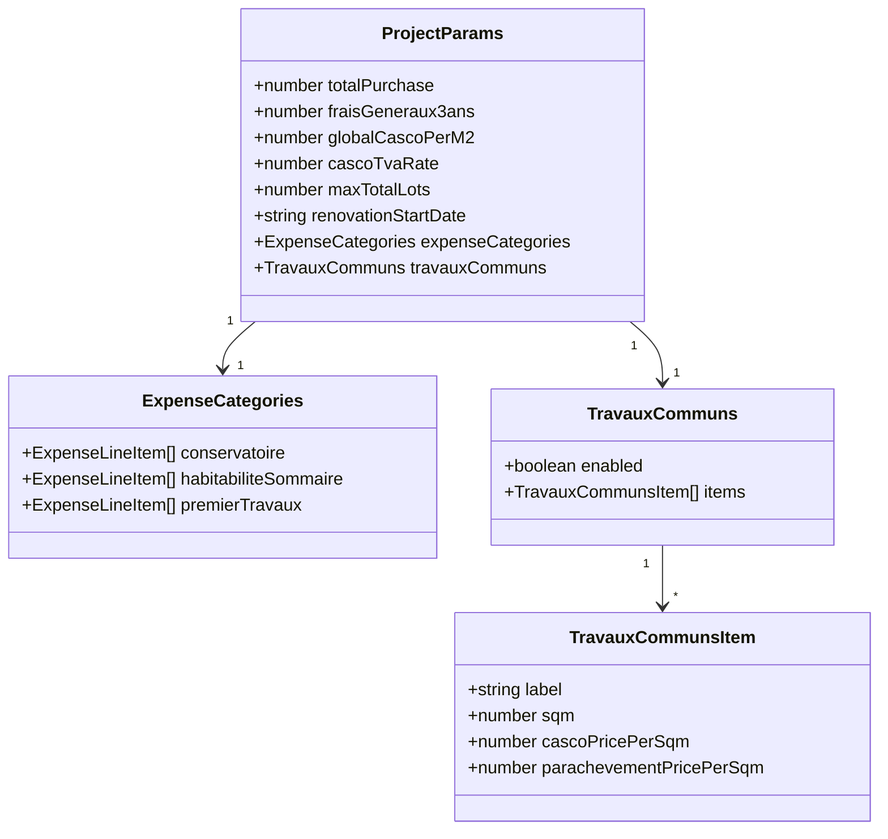

### State Machine Context

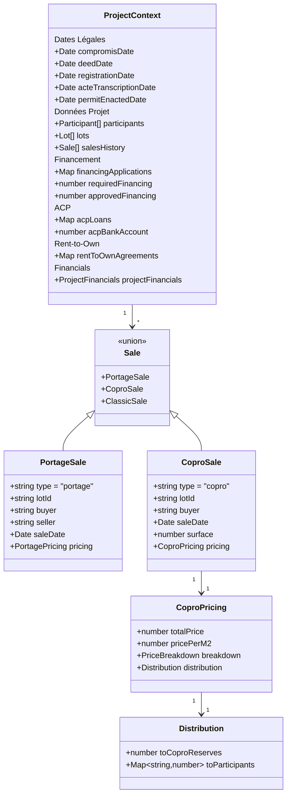

---

## Résumé des Règles Métiers Critiques

### 1. Quotité (Clé de Voûte)

```
quotité = surface_participant / surface_totale_à_date
```

- **Utilisée pour**: Prix nouveaux venus, redistribution copropriété, votes
- **Caractéristique**: Dilution progressive quand nouveaux participants arrivent
- **Important**: Dénominateur inclut l'acheteur pour calculer son prix

### 2. Indexation (Portage & Copropriété)

```
indexation = montant × [(1 + taux/100)^années - 1]
taux défaut = 2% par an (composé)
```

### 3. Redistribution Copropriété

```
Paiement nouveau venu:
  30% → Réserves copropriété
  70% → Redistribué proportionnellement à TOUS participants existants

Montant participant = 70% × quotité_participant
```

- **Récursif**: Gen 1 reçoit quand Gen 2 arrive
- **Proportionnel**: Basé sur quotité, pas égalité

### 4. Frais Généraux Dynamiques

```
Honoraires 3 ans = CASCO_HORS_TVA × 15% × 30%
Honoraires annuels = Honoraires 3 ans / 3
Total annuel = Honoraires annuels + Récurrent (7,988.38€)
Total 3 ans = Total annuel × 3
Par participant = Total 3 ans / N participants
```

### 5. Types de Ventes

| Type | Prix | Redistribution | Approbation |
|------|------|----------------|-------------|
| **Portage** | Base + Index + Frais | 100% vendeur | Non |
| **Copropriété** | Via quotité | 30% réserves + 70% tous | Non |
| **Classique** | Plafonné coût×1.10 | 100% vendeur | Oui |

---

## Références Code

- **State Machine**: `src/stateMachine/creditCastorMachine.ts`
- **Redistribution**: `src/stateMachine/creditCastorMachine.ts:243-397`
- **Portage**: `src/utils/portageCalculations.ts`
- **Calculateur**: `src/utils/calculatorUtils.ts`
- **Rent-to-Own**: `src/stateMachine/rentToOwnMachine.ts`

---

**Dernière mise à jour**: 2025-11-15
**Version**: 1.36.0
